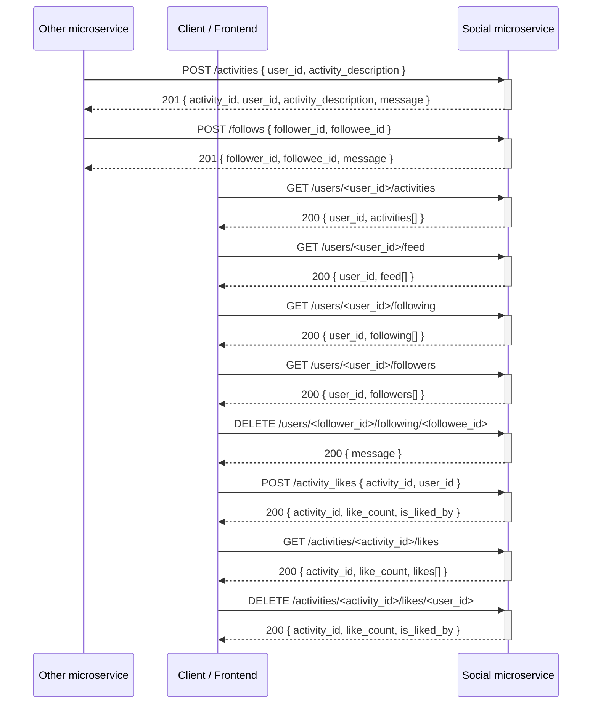

# Social Microservice

A small social Python + Flask API. Receives activities from other microservices, provides activities, social feeds, follows, and likes, and allows for updating of follows and likes.

## Setup

```bash
python -m venv venv
source venv/bin/activate   # Windows: venv\Scripts\activate
pip install -r requirements.txt
```

## Run

```bash
python app.py
```

Server runs at `http://127.0.0.1:8000`.

## API

| Method | Endpoint | Description |
|--------|----------|-------------|
| POST | `/activities` | Add activity. Body: `{"user_id": "...", "activity_description": "..."}` |
| GET | `/users/<id>/activities` | All activities for user `<id>` |
| GET | `/users/<id>/feed` | Social feed: activities from users that `<id>` follows |
| POST | `/follows` | Create follow. Body: `{"follower_id": "...", "followee_id": "..."}` |
| GET | `/users/<id>/following` | List users that `<id>` follows |
| GET | `/users/<id>/followers` | List users who follow `<id>` |
| DELETE | `/users/<follower_id>/following/<followee_id>` | Unfollow |
| POST | `/activity_likes` | Like an activity. Body: `{"activity_id": <id>, "user_id": "..."}` |
| GET | `/activities/<id>/likes` | List user IDs who liked activity `<id>` |
| DELETE | `/activities/<activity_id>/likes/<user_id>` | Remove like (unlike) |

## How to programmatically REQUEST data (REST API)

Example: get activities for one user.

| Method | URL |
|--------|-----|
| GET | `http://127.0.0.1:8000/users/<user_id>/activities` |

Requesting that data in Python:

```python
import requests

user_id = "alice"
response = requests.get(f"http://127.0.0.1:8000/users/{user_id}/activities")
```

## How to programmatically RECEIVE data (JSON)

Example response from **GET /users/<user_id>/activities** (200 OK):

```json
{
  "user_id": "alice",
  "activities": [
    {
      "activity_id": 1,
      "user_id": "alice",
      "activity_description": "Performed a workout",
      "created_at": "2025-02-23 12:00:00"
    }
  ]
}
```

Receiving that JSON in Python:

```python
data = response.json()

if response.ok:
    user_id = data["user_id"]
    activities = data["activities"]
else:
    error_message = data.get("error", "Unknown error")
```

## UML sequence diagram


