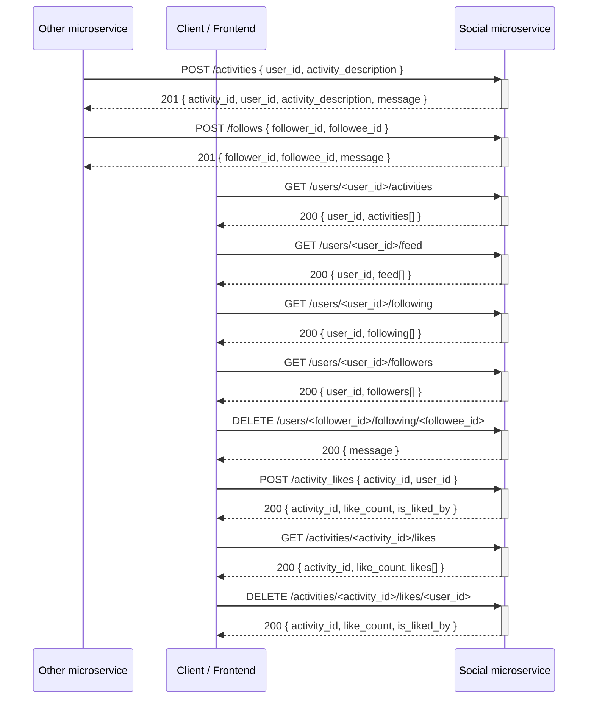

# Social Microservice

A small social Python + Flask API. Receives activities from other microservices, provides activities, social feeds, follows, and likes, and allows for updating of follows and likes.

## Setup

```bash
python -m venv venv
source venv/bin/activate   # Windows: venv\Scripts\activate
pip install -r requirements.txt
```

## Run

```bash
python app.py
```

Server runs at `http://127.0.0.1:8000`.

## API

| Method | Endpoint | Description |
|--------|----------|-------------|
| POST | `/activities` | Add activity. Body: `{"user_id": "...", "activity_description": "..."}` |
| GET | `/users/<id>/activities` | All activities for user `<id>` |
| GET | `/users/<id>/feed` | Social feed: activities from users that `<id>` follows |
| POST | `/follows` | Create follow. Body: `{"follower_id": "...", "followee_id": "..."}` |
| GET | `/users/<id>/following` | List users that `<id>` follows |
| GET | `/users/<id>/followers` | List users who follow `<id>` |
| DELETE | `/users/<follower_id>/following/<followee_id>` | Unfollow |
| POST | `/activity_likes` | Like an activity. Body: `{"activity_id": <id>, "user_id": "..."}` |
| GET | `/activities/<id>/likes` | List user IDs who liked activity `<id>` |
| DELETE | `/activities/<activity_id>/likes/<user_id>` | Remove like (unlike) |

## How to programmatically REQUEST data from this microservice

Data is requested from this microservice by sending HTTP GET requests to the appropriate endpoints. Example in Python:

```python
import requests

BASE_URL = "http://127.0.0.1:8000"
user_id = "alice"

response = requests.get(f"{BASE_URL}/users/{user_id}/activities")
activities = response.json()
```

Use the returned JSON as needed.

## How to programmatically RECEIVE data from this microservice

Data is received from this microservice when other services POST new activities or follow relationships to it. Example in Python:

```python
import requests

BASE_URL = "http://127.0.0.1:8000"

response = requests.post(
    f"{BASE_URL}/activities",
    json={
        "user_id": "alice",
        "activity_description": "Performed a workout",
    },
    headers={"Content-Type": "application/json"},
)
result = response.json()
```

## UML sequence diagram


